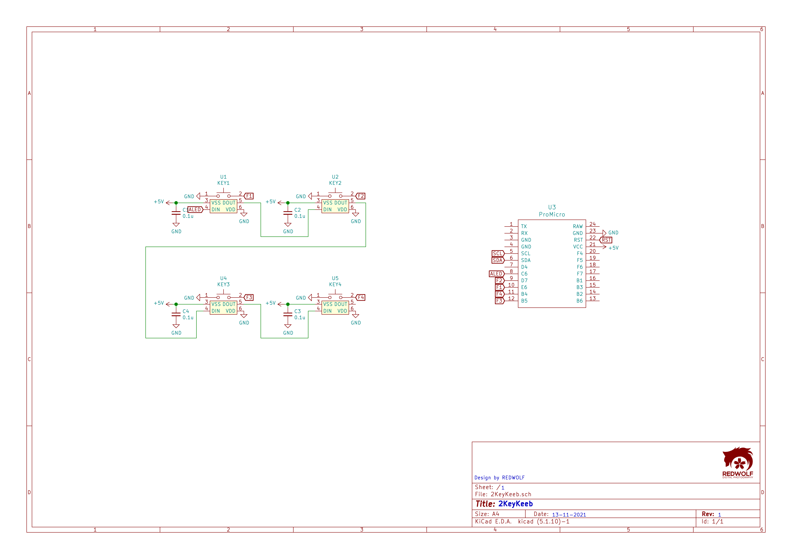
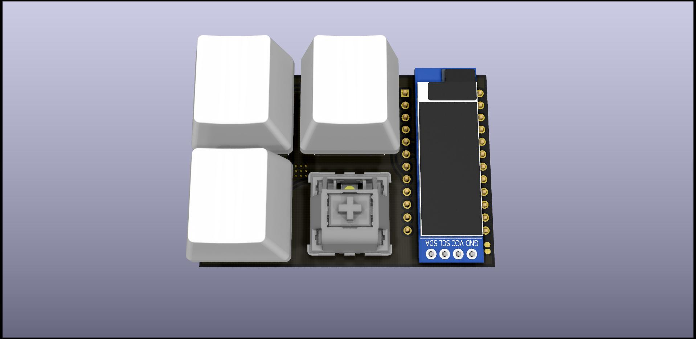

# KeebDev    
4Key keyboard QMK firmware with VIA  
ver 1.0  
  
🐺

# Controller
  - Atmega32u4  
  
    support addressable LED
    - WS2812/WS2812B
    - SK6812  
## Schematic

  
## Dimension

## Image

